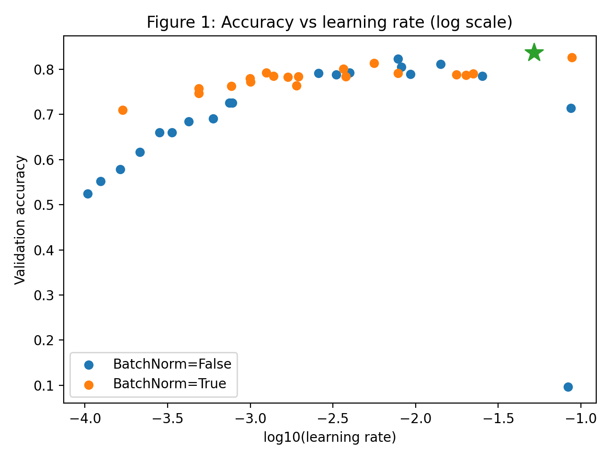
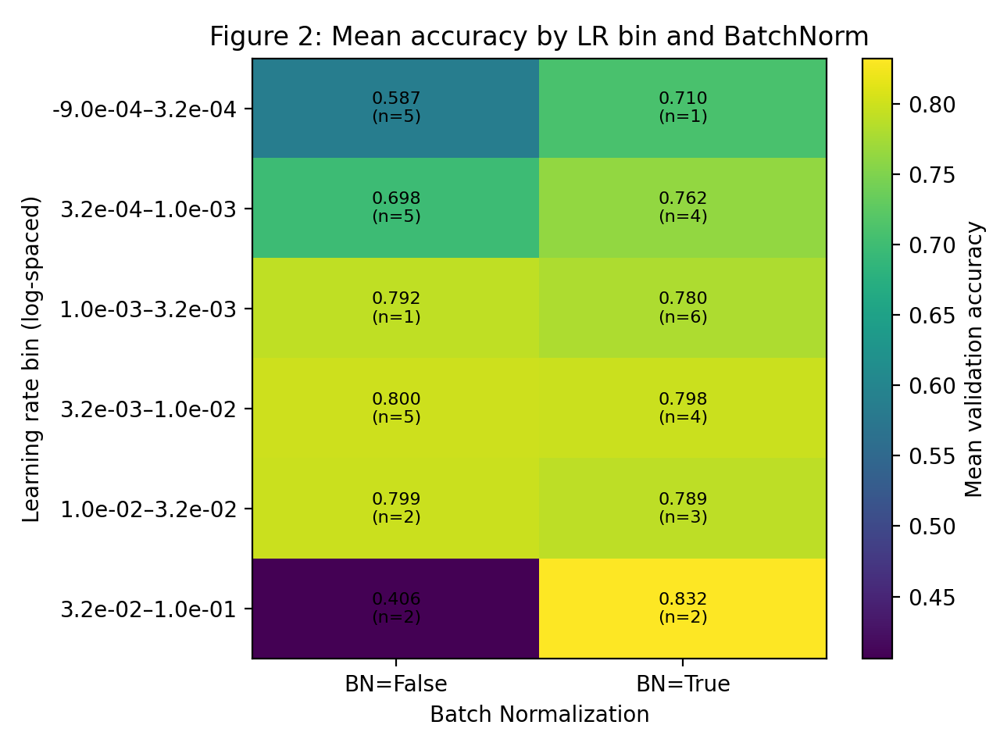

# Summary week 4
For this subject i tried a lot of different things. I tried to use the script and instructions from the course, but it didn't work. I also tried some hotfixes to get Ray working on windows, without any succes. As you can see in this folder, i tried to make a script that would run the ray on a windows machine. I also tried to split the script in different parts, as suggested for Ray on Windows. Even this didn't work. 
After A LOT of trying, i finally got something to work for this. I split the script in 2 parts, the main script, and the trainable.

# Hypothesis
For this test i used the following Hypothesis:
Batch Normalization improves model performance primarily at higher learning rates by stabilizing the optimization process.

The expected outcome:
- At low learning rates, models with and without Batch Normalization will perform similarly.
- At higher learning rates, models without Batch Normalization will show degraded performance or unstable training.
- Models with Batch Normalization will maintain higher validation accuracy over a wider range of learning rates.

This hypothesis is grounded in the theory that Batch Normalization reduces internal covariate shift and improves gradient flow, allowing the optimizer to operate effectively at higher learning rates.

# Dataset
i used the fashion MNIST dataset, which is a dataset of grayscale images. The dataset consists of 60,000 training images and 10,000 testing images, with each image being a 28x28 grayscale image. To reduce computational cost while maintaining sufficient complexity:
- a subset of 10.000 training samples and 5.000 validation samples was used.
- Images were normalized to zero mean and unit variance.
- No data augmentation was applied, ensuring the observed effects could be attributed to model and optimization choices.

# Model
I implemented a CNN model with the following architecture:
- A configurable number of convolutional blocks
- Each block containing:
    - A 2D convolution
    - Optional Batch Normalization
    - ReLU activation
    - Max pooling
- A global average pooling layer
- A fully connected classifier with dropout

The following architectural parameters were held constant during the experiments:
- Number of convolutional layers: 2
- Initial number of filters: 32
- Dropout rate: 0.2

This setup ensured that only the interaction between learning rate and Batch Normalization was investigated.

# Experiments
## Hyperparameters

The following hyperparameters were explored:
- Learning rate: sampled from a log-uniform distribution between 0.0001 and 0.1
- Batch Normalization: enabled or disabled

All models were trained using:
- Adam optimizer
- Cross-entropy loss
- Fixed training duration of 10 epochs

Importantly, no adaptive schedulers or early-stopping algorithms (such as HyperBand) were used. This guarantees that all models were trained for the same number of epochs, enabling fair comparison and meaningful visualizations.

## Execution

Hyperparameter tuning was performed using Ray Tune, resulting in a total of 40 trials:
- 20 trials with Batch Normalization
- 20 trials without Batch Normalization

Validation accuracy after the final epoch was used as the primary evaluation metric.

# Results
## Overall Performance

The best-performing configuration achieved a validation accuracy of 83.8% using:
- Learning rate ≈ 0.052
- Batch Normalization enabled

In contrast, models without Batch Normalization showed severe performance degradation at similar learning rates, with some trials collapsing to near-random accuracy.

## Effect of learning rate and Batch Normalization

Validation accuracy as a function of the logarithm of the learning rate, color-coded by Batch Normalization usage.

What this figure shows:
- X-axis: log10(learning rate)
- Y-axis: validation accuracy
- Two groups/colors: BatchNorm = True / False

Observed pattern:

At low learning rates, both configurations perform moderately but are limited by slow convergence.
At medium learning rates, both configurations achieve competitive performance.
At high learning rates, models without Batch Normalization frequently fail, while Batch-Normalized models remain stable.

## Heatmap Analysis

Heatmap of mean validation accuracy across learning-rate bins for models with and without Batch Normalization.

What this figure shows:
- Bin learning rates on a logarithmic scale
- Rows: learning-rate bins (low → high)
- Columns: BatchNorm enabled / disabled
- Cell value: mean validation accuracy

This visualization clearly highlights the interaction effect: Batch Normalization substantially improves performance in high learning-rate regimes.

# Conclusion

Based on the analysis, the following conclusions can be drawn:
- Batch Normalization improves model performance primarily at higher learning rates by stabilizing the optimization process.
- At low learning rates, models with and without Batch Normalization tend to achieve similar validation accuracy.
- At higher learning rates, models without Batch Normalization tend to show degraded performance or unstable training behaviour, including partial training collapse.
- Models with Batch Normalization maintain higher and more stable validation accuracy across a wider range of learning rates.

These findings are consistent with the hypothesis, and provide further evidence for the effectiveness of Batch Normalization in improving model performance.
Here are the [instructions](./instructions.md) and here is a script to start [hypertune.py](./hypertune.py)

[Go back to Homepage](../README.md)
